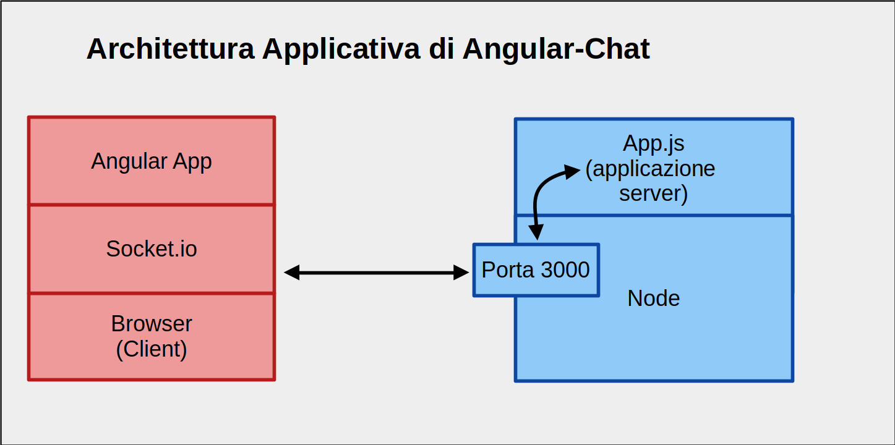

# Angular Chat


## Architettura Applicativa di Angular Chat

   
 
 
## Il Server di Angular-Chat

Il server di Angular Chat è realizzato con Node. Per effettuare lo start

```bash
   # cd Chat-Node-Server
   # npm install               
   # npm start
```

## Il Client di Angular-Chat

Il Client di Angular Chat è realizzato con ... Angular. Per effettuare lo start

```bash
   # cd Chat-Angular-Client
   # npm install             
   # ng serve
```

Utilizza un browser per accedere all'applicazione disponibile sulla porta 4200
